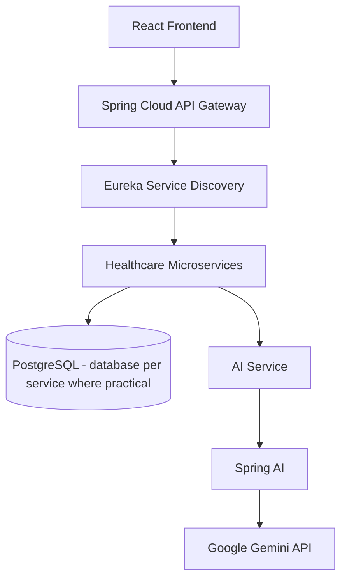

# MedFlow AI - An Agentic Cloud-Native Healthcare Intelligence Platform using Microservices, DevOps and DevSecOps

## Project Overview

| Field | Value |
|---|---|
| Subject | Adaptive Software Engineering (ASE) |
| Institution | KLH |
| Branch | CSE |
| Academic Year | 2026-2027 |
| Team / Repository ID | 2420030474 |
| Required repository | `KLH-CSE-2026-2027-2420030474-MedFlowAI` |
| Current phase | Phase 1 - Requirements and Architecture |

### Team

| Member | University ID |
|---|---|
| Doma Akshaya | 2420030474 |
| Jithyasri | To Be Provided |
| Sreeja | To Be Provided |

**Supervisor:** To Be Confirmed

Missing IDs and the supervisor name are intentionally left as placeholders and must be updated only from verified information.

## Abstract

Healthcare organizations increasingly rely on digital systems to manage patients, clinicians, appointments, medical records, laboratory services, pharmacy operations, billing, and emergency care. Yet many conventional healthcare management applications remain fragmented and process-centric, demanding extensive manual coordination across departments while offering limited intelligent support. This can result in duplicated information, delayed communication, inefficient appointment and queue management, difficulty interpreting medical documents, fragmented patient records, and slower response to operational and emergency requirements. These challenges highlight the need for a scalable, secure, and intelligent healthcare platform capable of integrating healthcare services while supporting stakeholders through context-aware assistance and decision support.

MedFlow AI proposes an agentic, cloud-native healthcare intelligence platform that addresses these challenges by combining service-oriented microservices, artificial intelligence, and modern software engineering practices. The platform is designed to support patients, doctors, nurses, receptionists, laboratory staff, pharmacists, billing personnel, emergency staff, and administrators through role-based workflows covering authentication, patient profiles and medical histories, appointment management, queue handling, medical records, laboratory reports, prescriptions, pharmacy operations, billing, notifications, and emergency support. The AI layer is planned using Spring AI and the Google Gemini API and will coordinate specialized agents such as Patient, Doctor, Emergency, Pharmacy, Billing, and Hospital Operations Assistants. These agents are intended to provide contextual assistance including healthcare service guidance, medical-report summarization, clinical information organization, appointment and queue support, medication and inventory insights, bill explanation, and hospital operational recommendations. The AI functionality will serve as decision support under appropriate human oversight rather than autonomous medical diagnosis or treatment.

The planned system will use Java 21, Spring Boot, Spring Cloud, React.js, PostgreSQL, Spring Security, JWT, Spring Cloud Gateway, Eureka Service Discovery, and OpenFeign. A database-per-service approach will promote modularity, service independence, maintainability, and scalability. Docker and Kubernetes will support containerization and orchestration, with AWS considered as the cloud deployment target. The development lifecycle will follow Agile Scrum practices using Jira, while Git, GitHub, and GitHub Actions will support collaborative development and continuous integration and delivery. DevSecOps practices will incorporate SonarQube, Trivy, and OWASP ZAP for code-quality and security validation, while Spring Boot Actuator, Prometheus, and Grafana will provide observability. The proposed platform aims to reduce manual coordination, improve healthcare workflow efficiency, strengthen security, provide faster access to relevant information, and demonstrate an extensible approach for integrating agentic AI with cloud-native, security-first software engineering.

## Problem Statement

Healthcare delivery is often affected by fragmented systems and information distributed across departments. Manual coordination delays appointments, laboratory work, prescriptions, billing, notifications, and emergency response. Staff may not have a timely unified view of a patient's authorized information, while patients can struggle to interpret documents or navigate available services. Appointment and queue inefficiency, delayed communication, fragmented patient records, emergency workflow delays, and limited intelligent assistance reduce operational effectiveness.

A useful solution must connect workflows without creating an insecure monolith. It must provide contextual AI assistance while keeping healthcare professionals responsible for sensitive decisions.

## Proposed Solution

MedFlow AI is a **planned** agentic, cloud-native, microservice-based healthcare intelligence platform. It is designed to be security-first, scalable, AI-assisted, observable, and suitable for independent service deployment. Role-based workflows will connect core healthcare services, while a dedicated AI Service will use Spring AI and Google Gemini API for specialized assistance.

AI outputs will remain drafts, explanations, summaries, or recommendations subject to validation and human oversight. The platform will not autonomously diagnose, prescribe, or execute sensitive healthcare decisions.

## Objectives

1. Reduce manual cross-department coordination through well-defined service workflows.
2. Provide secure, role-appropriate access to relevant healthcare information.
3. Improve appointment, queue, notification, and emergency workflow visibility.
4. Demonstrate specialized agentic AI rather than a single generic chatbot.
5. Apply microservices, cloud-native and database-per-service principles pragmatically.
6. Use Agile Scrum, Jira, progressive commits, pull requests, and review traceability.
7. Plan automated testing, CI/CD, DevSecOps validation, and observability from the beginning.
8. Protect credentials and use synthetic healthcare data only.

## Target Users / Roles

1. Patient
2. Doctor
3. Nurse
4. Receptionist
5. Laboratory Staff
6. Pharmacist
7. Billing Staff
8. Emergency Staff
9. Administrator

Permissions will follow role-based access control and least privilege. Every role will not have unrestricted access to every record.

## Planned AI Agents

The following are **planned components and are not implemented on Day 1**:

1. **Patient Assistant** - service guidance, appointment help, queue assistance, and general hospital information.
2. **Doctor Assistant** - medical-record and laboratory-report summarization for doctor review.
3. **Emergency Assistant** - structured emergency intake, rule-based priority support, and staff notification assistance.
4. **Pharmacy Assistant** - medication information, prescription-related help, stock insights, and low-stock alerts.
5. **Billing Assistant** - bill-component explanation and billing-query support.
6. **Hospital Operations Assistant** - queue, appointment, resource, and operational summaries.

AI provides decision support under human oversight and is not intended to autonomously diagnose, prescribe, or execute sensitive healthcare decisions.

## Planned Technology Stack

Every technology below is **planned**, not yet implemented.

| Area | Planned technologies |
|---|---|
| Backend | Java 21, Spring Boot, Spring Cloud, Maven |
| Frontend | React.js, JavaScript, Axios, React Router |
| Database | PostgreSQL, Spring Data JPA, Hibernate |
| Microservices | Spring Cloud Gateway, Eureka Service Discovery, OpenFeign, REST APIs |
| Security | Spring Security, JWT, RBAC |
| AI | Spring AI, Google Gemini API |
| DevOps | Git, GitHub, GitHub Actions, Docker, Docker Compose, Kubernetes, Minikube |
| DevSecOps | SonarQube, Trivy, OWASP ZAP |
| Monitoring | Spring Boot Actuator, Prometheus, Grafana |
| Testing/API | JUnit, Mockito, Postman, Swagger/OpenAPI |
| Project management | Jira, Agile Scrum |
| Cloud | AWS, considered for a later deployment phase |

## High-Level Architecture



The healthcare-services layer is planned to include authentication, patient, doctor, appointment, medical-record, laboratory, pharmacy, billing, notification, and emergency capabilities. The architecture will be refined as interfaces, constraints, and implementation evidence emerge.

## Agile / Scrum

The project will maintain a prioritized product backlog with epics, user stories, tasks, defects, acceptance criteria, and story points in Jira. Work will be delivered in short sprints with daily progress inspection, sprint reviews, and retrospectives. Feedback and evidence will continuously adapt the backlog and architecture.

Required traceability:

```text
Jira Issue -> Git Branch -> Commit -> Pull Request -> Code Review -> Merge -> Deployment
```

Branches will follow `main`, `develop`, and `feature/*`. Every team member must use their own GitHub account. Future phase tags are documented as `review-1`, `review-2`, and `final`, but no tag is created on Day 1.

## DevOps

Git and GitHub will provide collaborative version control. GitHub Actions is planned to automate builds and tests. Docker and Docker Compose will provide reproducible packaging and local integration, while Kubernetes and Minikube will support orchestration demonstrations. These capabilities are planned for later phases.

## DevSecOps

- **SonarQube:** planned static code-quality and security analysis.
- **Trivy:** planned dependency, image, and configuration vulnerability scanning.
- **OWASP ZAP:** planned dynamic testing of the deployed web/API surface.

Only evidence generated by actual tool executions will be stored in `results/`.

## Testing

Planned verification includes unit, integration, API, security, end-to-end, performance, and AI-evaluation testing. JUnit, Mockito, Spring Boot testing support, Postman, and Swagger/OpenAPI will be introduced with the implementation. No test result is claimed on Day 1.

## Monitoring

Spring Boot Actuator is planned to expose service health and metrics. Prometheus will collect request, latency, error, and availability measures; Grafana will visualize them. Monitoring evidence will be stored only after the system is executable.

## Repository Structure

```text
KLH-CSE-2026-2027-2420030474-MedFlowAI/
|-- README.md
|-- src/
|   `-- README.md
|-- docs/
|   |-- README.md
|   |-- agile/day-1-agile-plan.md
|   |-- api/README.md
|   |-- architecture/high-level-architecture.md
|   |-- diagrams/README.md
|   |-- requirements/day-1-requirements.md
|   |-- security/security-baseline.md
|   `-- testing/testing-strategy.md
|-- data/README.md
|-- results/README.md
|-- reports/README.md
|-- infrastructure/README.md
|-- tests/README.md
|-- .gitignore
`-- .env.example
```

## Setup Prerequisites

The following are prerequisites for later phases; this README does not claim they are installed:

- Git and personal GitHub accounts
- Java 21
- Maven 3.9+
- Node.js LTS and npm
- PostgreSQL
- Docker Desktop
- Minikube and kubectl
- Postman
- Jira
- Google Gemini API access in a later phase
- AWS access in a later phase, if practical

## Setup Instructions

Day 1 contains planning, requirements, architecture, security, testing, and Agile documentation only. There is no application to build or execute. Actual application setup begins on Day 2 after approval.

When implementation begins, create a local environment file:

```powershell
Copy-Item .env.example .env
```

Replace placeholders locally and never commit `.env`.

## Security

- Use `.env` and environment variables for local secrets.
- Never commit credentials, Gemini API keys, JWT secrets, database passwords, or AWS keys.
- Use synthetic/test healthcare data only.
- Never upload real patient or confidential institutional information.
- Keep Gemini access in the backend AI Service; never expose provider keys to React.
- Apply Spring Security, JWT, RBAC, input validation, least privilege, and audit logging during implementation.

## Current Status

### Phase 1 - Requirements and Architecture

**Completed**

- Project identity
- Repository structure
- Problem statement and abstract
- Objectives
- Requirements baseline
- Architecture baseline
- Security baseline
- Testing strategy
- Agile plan

**In Progress**

- GitHub collaboration setup
- Jira setup
- Supervisor/coordinator access
- Development-environment verification
- Confirmation of missing team IDs and supervisor name

**Upcoming**

- Day 2 application scaffold

## GitHub Compliance

- Use exactly one team repository named `KLH-CSE-2026-2027-2420030474-MedFlowAI`.
- Do not rename or transfer it after official recording without written approval.
- Use meaningful progressive commits from each member's own GitHub account.
- Protect `main`; integrate through `develop` and reviewed `feature/*` branches.
- Do not commit secrets, restricted data, fake results, generated dependencies, or build artifacts.

