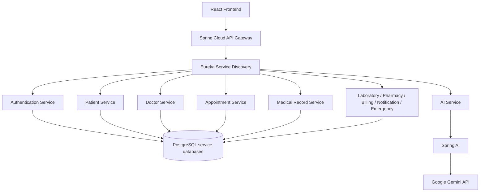

# High-Level Architecture Baseline

## Architecture Overview

MedFlow AI is proposed as a React-based, cloud-native healthcare intelligence platform backed by independently deployable Spring Boot services. Spring Cloud Gateway will provide a governed edge, Eureka will support service discovery, and PostgreSQL will provide service-owned persistence where practical.

## Microservices Approach

Services will own their rules and persistence boundaries, expose REST APIs, and avoid direct writes to another service's database. The team will begin with the minimum services required for a complete golden path to avoid over-engineering.

## API Gateway

The gateway is planned to centralize routing, cross-origin policy, selected rate limits, token validation support, and correlation identifiers. Domain authorization remains enforced within services.

## Eureka

Services are planned to register with Eureka and resolve logical service identities without hardcoded instance addresses.

## Healthcare Services

Planned capabilities include authentication, patients, doctors, appointments, medical records, laboratory, pharmacy, billing, notifications, and emergency workflows. Implementation will be progressive and evidence-based.

## AI Service

The backend-only AI Service will integrate Spring AI and Gemini, coordinate specialized assistants, retrieve authorized context through service APIs, validate prompts/outputs, collect feedback, and require human review for sensitive outcomes. React will never receive the Gemini API key.

## PostgreSQL

A database-per-service approach is preferred. During local development, services may share one PostgreSQL server while using separate logical databases, schemas, users, and ownership boundaries.

## React Frontend

React will provide role-appropriate user experiences and will access backend capabilities only through the gateway.

## Future Kubernetes Deployment

Docker images are planned to run in Minikube/Kubernetes with configuration, secrets, health probes, resource limits, and observability. AWS is a possible later target if time and cost permit. No deployment exists on Day 1.

